# Cellular Automata Cave Generator

# Overview

## Description

This simple console application is to explore procedural generation of 'cave like' levels using *Cellular Automata* to generate 'natural' looking cave systems.
This application is focused on the procedural generation of the maps so simply prints random maps to the console. However, the aim it to utilize the `RandomCave`
Class at a later stage to make a procedurally generated console game. Below is an example of the output from this application:

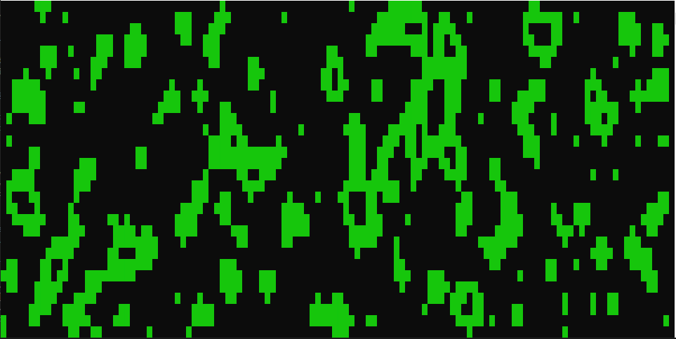

## What is a Cellular Automata?

Cellular Automata are grid based systems that consist of an array of *bools*, each of the cells in the grid are bound by a set of very simple rules. These rules
govern if each cell *Lives* or *Dies* in each cycle of the simulation. A good example of *Cellular Automata* in practice is **Conway's Game of Life**
([Conway's Game of Life Wikipedia Page](https://en.wikipedia.org/wiki/Conway%27s_Game_of_Life)).

In **Conway's Game of Life** each cell is governed by the below simple set of rules:

  * If a *living* cell had less than **2** *living* neighbors, it is *killed*.
  * If a *living* cell had **2 or 3** *living* neighbors, it stays *alive*.
  * If a *living* cell had more than **3** *living* neighbors, it is *killed*.
  * If a *dead* cell had exactly **3** *living* neighbors, it is *born*.

| **NOTE** | In the context of this page when a cell is *Alive* is a `true` bool value. |
|---------|:----------------------------------------------------------------------------|

The results produced by the simple rules that govern **Conway's Game of Life** can be surprisingly complex often leading to moving or repeating patterns for examples
please see the *Examples of Patterns* section of [Wikipedia Page](https://en.wikipedia.org/wiki/Conway%27s_Game_of_Life).

## How Does Cave Generator Work?

The *Cave Generator* works in a very similar manner to **Conway's Game of Life** where a *bool* array is created to represent a map, where all 'living' cell will be
printed to the console as a *Wall*. Again, in a similar manner to **Conway's Game of Life** the map is generated by applying a simple set or rules each *simulation
step*. The process for cave generation is shown below;

  1. A 2D *bool* array is initialized to match the console window size. So each position in the array represents one position on the console application window.
  2. A probability is set for cells to be spawned *Alive*. This is represented by a percentage.
  3. The 2D array is iterated through randomly assigning each cell as *Dead* or *Alive* weighted by the probability set in **Step 2**.
  4. *Simulation Step* is run to apply the *rules* to each cell in the array. The rules applied to each cell are below:
    * If a *Dead* cell has a number of *Alive* neighbors > *birthLimit* then the cell is *Born*.
    * If an *Alive* cell has a number of *Alive* neighbors > *deathLimit* then the cell is *Killed*.
  5. The results of the *Simulation Step* are returned as a new 2d array.
  6. The *Simulation Step* will be run in a loop until the required map appearance is achieved.
  7. Using the 2D Array the map is printed to the console window.

When counting the *Alive* neighbors cells within the *Moore Neighborhood* are considered. The *Moore Neighborhood* is the **8** cells immediately surrounding the
cell in question. The below image shows the *Moore Neighborhood*:


# `RandomCave` Class

## Description

The `RandomCave` Class is responsible for the procedural generation of the cave maps. It also has methods to print the maps to the console. It also has a number of
properties that can be used to tweak the procedurally generated output.

## Properties

`DebugEnabled` - Toggles the debug output of the `RandomCave` Class. `True` means output is printed. (Default **False**)

`PerimeterWallsEnabled` - Toggles the perimeter walls around the cave map by changing how `countAliveNeighbours` method counts. (Default **False**)

`ChanceToStartAlive` - Sets the probability of cells initially spawning *Alive*. (Default **29%**)

`BirthLimit` - Sets the number of *Alive Neighbors* a *Dead* cell needs to be **Born**. (Default **4**)

`DeathLimit` - Sets the number of *Alive Neighbors* an *Alive* cell needs to be **Killed**. (Default **3**)

`SimulationSteps` - Sets how many times `simulationStep()` will be run. (Default **2**)

`WallColor` - Sets the cave wall color. (Default **`ConsoleColor.Green`**)

## Methods

### Public Methods

#### PrintMap

This method is used to print the map to the console. First, the console is cleared using `Console.Clear()`. Once the console window has been cleared the map 2D Array is looped through and each cell checked. If the cell is `True` a `█` *Wall Character* is printed, if `False` the cell is left blank.

The `PrintMap` method takes in a 2D bool array (`bool[,]`) called *map*.

The `PrintMap` method is below:
```C#
public void PrintMap(bool[,] map)
        {
            Console.Clear();

            for (int x = 0; x < map.GetLength(0); x++)
            {
                for (int y = 0; y < map.GetLength(1); y++)
                {
                    if (map[x, y])
                    {
                        Console.SetCursorPosition(x, y);
                        Console.Write("█");
                    }
                }
            }
        }
```
#### GenerateCave

The `GenerateCave` method returns a 2D bool array that contains the randomized cave map. This map is produced by:

  1. Initializing a map of random cells.
  2. Running the Simulation Step the number of times defined in `SimulationSteps`.
  3. Returning cave 2D bool array.

If `DebugEnabled` is `true` then this method will return the `ChanceToStartAlive`, `BirthLimit`, `DeathLimit` and `SimulationSteps` along with additional debug information to the debug console.

The `GenerateCave` method is below:
```C#
public bool[,] GenerateCave()
        {
            bool[,] seedMap = initializeMap();

            // Debug output
            if (DebugEnabled)
            {
                Debug.WriteLine(String.Format("DEBUG: Chance To Start Alive -- {0}%.", ChanceToStartAlive));
                Debug.WriteLine(String.Format("DEBUG: Birth Limit -- {0}.", BirthLimit));
                Debug.WriteLine(String.Format("DEBUG: Death Limit -- {0}.", DeathLimit));
                Debug.WriteLine(String.Format("DEBUG: Simulation Steps -- {0}.", SimulationSteps));
            }

            for (int step = 0; step < SimulationSteps; step++)
            {
                seedMap = simulationStep(seedMap);

                // Debug output
                if (DebugEnabled)
                {
                    Debug.WriteLine(String.Format("DEBUG: Simulation Step {0} Complete.", (step +1)));
                }
            }

            return seedMap;
        }

    }
```

### Private Methods

#### initializeMap

This method is used to create the initial randomized *Cell Map*. This *Cell Map* consists of randomly assigned *Alive* and *Dead* cells in an array with the same dimensions as the console window. The probability of a cell being initialized as *Alive* is governed by the `ChanceToSpawnAlive` property.

If `DebugEnabled` is `true` this method will print the Console window size.

If the output array for `initializeMap`:

```C#
private bool[,] initializeMap()
       {
           // Prints Debug output
           if (DebugEnabled)
           {
               Debug.WriteLine("DEBUG MODE ENABLED");
               Debug.WriteLine(String.Format("DEBUG: Console Size -- {0} x {1}", Console.WindowWidth, Console.WindowHeight));
           }

           // Assign a blank 2D bool array the size of the console window. [x,y]
           bool[,] startingMap = new bool[Console.WindowWidth,Console.WindowHeight];
           // Create a random number generator.
           Random randomNumber = new Random();

           // Loop through every cell in the array and used random number to see if the cell starts 'alive'.
           for (int x = 0; x < startingMap.GetLength(0); x++)
           {
               for (int y = 0; y < startingMap.GetLength(1); y++)
               {
                   // Cell starts alive if random number < ChanceToStartAlive
                   if (randomNumber.Next(0, 100) <= ChanceToStartAlive)
                   {
                       startingMap[x, y] = true;
                   }
               }
           }

           // Return initialised map
           return startingMap;
       }
```

#### countAliveNeighbours

This method takes in a map and a position and returns a count of the *Alive Neighbors* of the cell at the position `xPosition`, `yPosition`. This checks the *Moore  Neighborhood*, the surrounding 8 cells. As shown by the below illustration:


The `countAliveNeighbours` method is shown below:
```c#
private int countAliveNeighbours(bool[,] map, int xPosition, int yPosition)
        {
            int count = 0;

            // Loop through 8 surrounding neighbours. (Moore Neighborhood)
            for (int i = -1; i < 2; i++)
            {
                for (int j = -1; j < 2; j++)
                {
                    int neighbourXPosition = xPosition + i;
                    int neighbourYPosition = yPosition + j;

                    if(i == 0 && j == 0)
                    {
                        // Do nothing, this is the current cell.
                    }
                    else if(isOutOfMapArea(map, neighbourXPosition, neighbourYPosition))
                    {
                        // If PerimeterWallsEnabled == false then the out of bounds cells are included in the count
                        // this increases the chance of the cell dying, hence the removal of perimeter walls.
                        if (!PerimeterWallsEnabled)
                        {
                            count++;
                        }
                    }
                    else if(map[neighbourXPosition, neighbourYPosition])
                    {
                        // If cell is alive increment count.
                        count++;
                    }
                }
            }

            return count;
        }
```
If `PerimeterWallsEnabled` is `false` when a cell's neighbor is *Out of Bounds* it is counted as an *Alive* cell, this will increase the chance of the cell being *Killed*, hence removing the perimeter wall around the map. See below images for a comparison between a map with and without `PerimeterWallsEnabled`.

Below is a map with `PerimeterWallsEnabled` set to `False`:

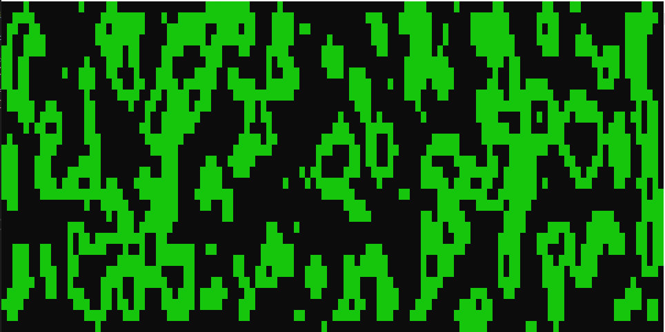

Below is a map with `PerimeterWallsEnabled` set to `True`:

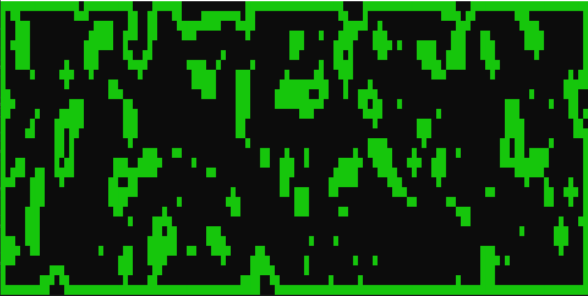

The ability to toggle the perimeter wall adds some versatility to what these maps can be used for.

#### isOutOfMapArea

This method take in a map and position and returns a bool. If the position is within the map area it will return `False` and if the point is outside the map area it will return `True`.

```c#
private bool isOutOfMapArea(bool[,] map, int xPosition, int yPosition)
        {
            bool isOutOfArea;

            //If the position is out of bounds return true.
            if (xPosition < 0 || yPosition < 0 || xPosition >= map.GetLength(0) || yPosition >= map.GetLength(1))
            {
                isOutOfArea = true;
            }

            //If the position is in bounds return false.
            else
            {
                isOutOfArea = false;
            }

            return isOutOfArea;
        }
```
#### simulationStep

This method applies the cellular automata rules to the bool array to *'smooth'* the map and make it look more natural and random. The each cell has its number of *Alive Neighbors* counted using the `countAliveNeighbours` method. Then the following rules are applied to the cell based on the number of *Alive Neighbors*:

  * If a *living* cell had less than **2** *living* neighbors, it is *killed*.
  * If a *living* cell had **2 or 3** *living* neighbors, it stays *alive*.
  * If a *living* cell had more than **3** *living* neighbors, it is *killed*.
  * If a *dead* cell had exactly **3** *living* neighbors, it is *born*.

The `simulationStep` method takes in a 2D bool array and returns a new 2D bool array one the `simulationStep` rules have been applied to every cell in the array.

The `simulationStep` method is shown below:
```C#
private bool[,] simulationStep(bool[,] oldMap)
        {
            // Set newMap array size to match oldMap
            bool[,] newMap = new bool[oldMap.GetLength(0), oldMap.GetLength(1)];

            // Loop through every cell in oldMap applying rules and place result for this cell in newMap array
            for (int x = 0; x < oldMap.GetLength(0); x++)
            {
                for (int y = 0; y < oldMap.GetLength(1); y++)
                {
                    int aliveNeighbours = countAliveNeighbours(oldMap, x, y);

                    // If cell is Alive
                    if (oldMap[x,y])
                    {
                        if ( aliveNeighbours >= DeathLimit)
                        {
                            // Kill Cell
                            newMap[x, y] = false;
                        }

                        else
                        {
                            // Cell Lives
                            newMap[x, y] = true;
                        }
                    }

                    // If cell is Dead
                    else
                    {
                        if(aliveNeighbours >= BirthLimit)
                        {
                            // Cell is Born
                            newMap[x, y] = true;
                        }

                        else
                        {
                            // Cell remains Dead
                            newMap[x, y] = false;
                        }
                    }
                }
            }

            return newMap;
        }
```
## Spawning Options

Although the default values for each of the `RandomCave` properties have been sent to consistently give good and varied results it is possible to manually tweak these values in order to expand the variety of map types. The following sections will show very roughly the impact of changing each of these properties.

As they have been covered elsewhere in this README `DebugEnabled` and `PerimeterWallsEnabled` have not been included in this section.

For each of the sections the properties are kept at the default values except the one indicated in the section.

### ChanceToStartAlive

Map with a *Low* **ChanceToStartAlive**:

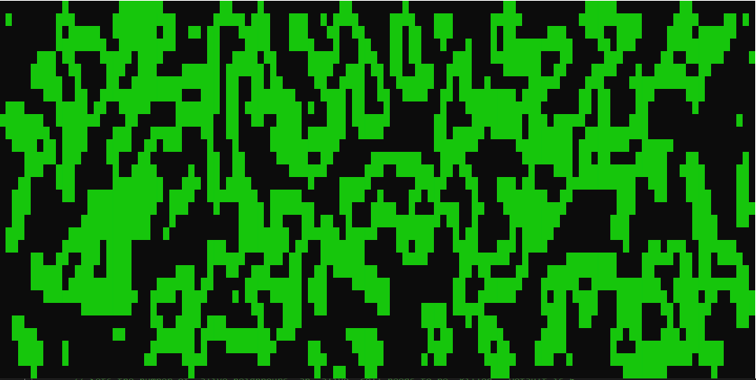

Map with a *High* **ChanceToStartAlive**:

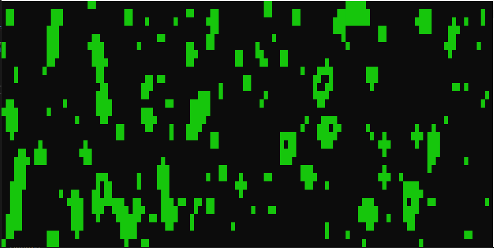

### BirthLimit

Map with a *Low* **BirthLimit**:

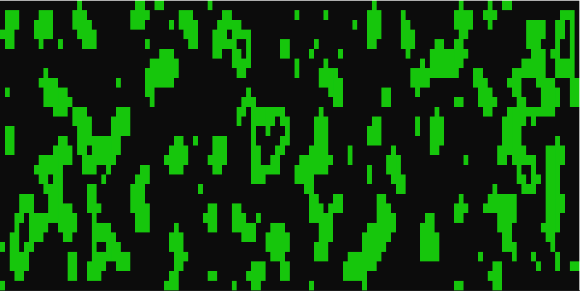

Map with a *High* **BirthLimit**:

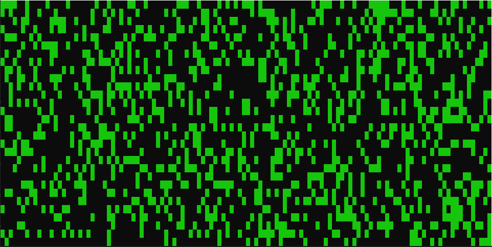

### DeathLimit

Map with a *Low* **DeathLimit**:

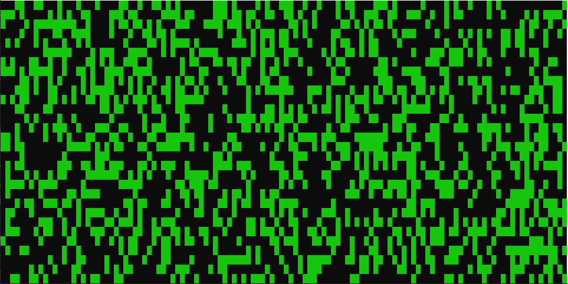

Map with a *High* **DeathLimit**:

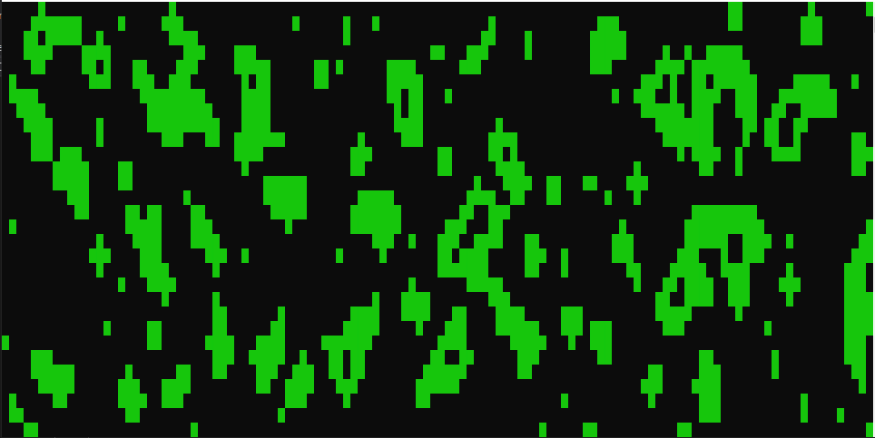

### SimulationSteps

Map with a run for **2** *SimulationSteps*:

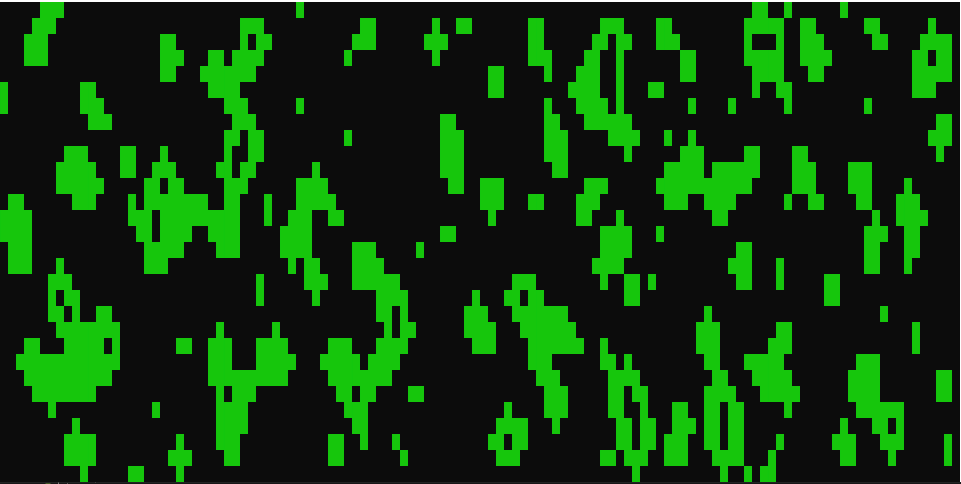

Map with a run for **4** *SimulationSteps*:

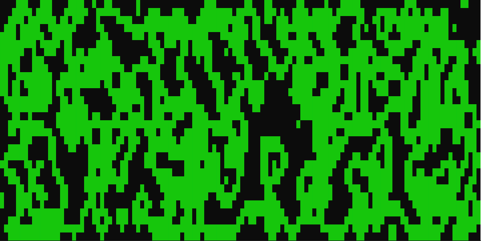

Map with a run for **8** *SimulationSteps*:

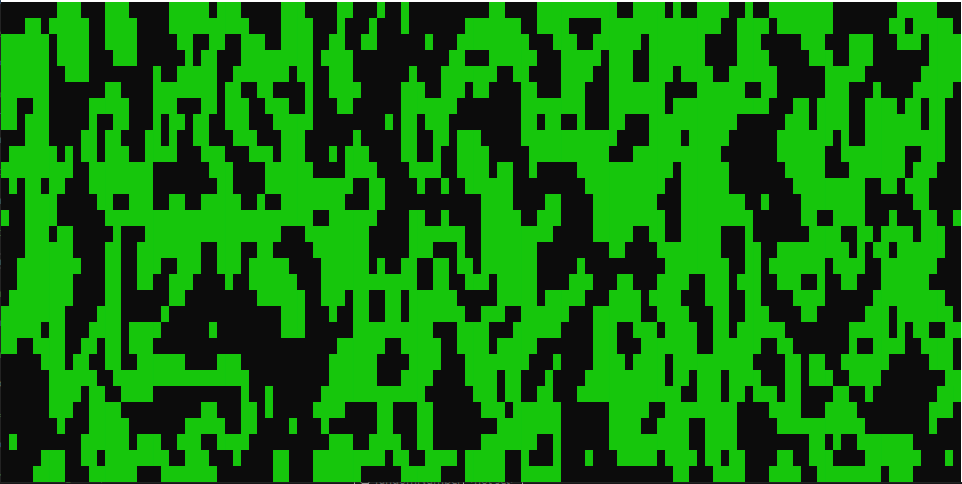

### WallColor

Map with a **WallColor** of `ConsoleColor.Red`:

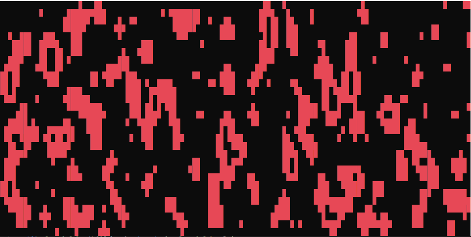

Map with a **WallColor** of `ConsoleColor.DarkCyan`:

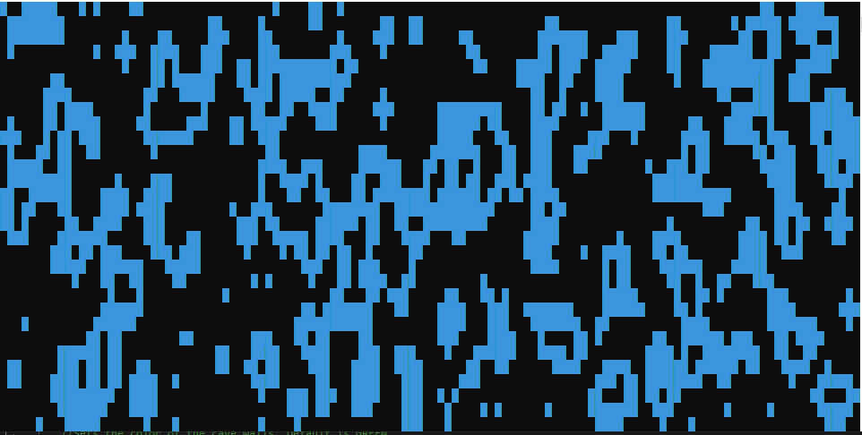

# `Title` Class

## Description

The `Title` Class is used to produce the *Welcome Screen* for the application (default welcome screen shown in the below image). It includes the ASCII art, coloring, and method to print the *Welcome Screen*.

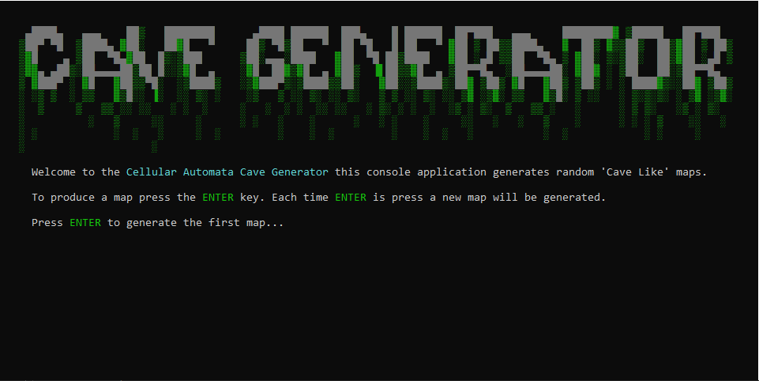

## Methods

### Public Methods

#### PrintWelcomeScreen

This method simply prints the welcome screen to the Console. It uses the `Console.Clear()` method to ensure the Console is empty before printing.

The `PrintWelcomeScreen` method is below:
```C#
public void PrintWelcomeScreen()
{
    Console.Clear();
    printTitle();
    printWelcomeMessage();
}
```

### Private Methods

#### printTitle

This method stores the ASCII art for the title and prints it to the console. It also loops through each of the characters in *titleArt* and applies the correct color.

The `printTitle` method is below:
```C#
private void printTitle()
        {
            // ======= Private Methods =======
            // Title ASCII art for the application.
            string titleArt = @"

    ▄████▄   ▄▄▄    ██▒   ████████      ▄████ ██████  ███▄    █ ██████  ██▀███   ▄▄▄     ████████▓ ▒█████   ██▀███  
   ▒██▀ ▀█  ▒████▄ ▓██░   ██▓█   ▀     ██▒ ▀█▒██   ▀  ██ ▀█   █ ██   ▀ ▓██ ▒ ██▒▒████▄   ▓  ██▒ ▓▒▒██▒  ██▒▓██ ▒ ██▒
   ▒▓█    ▄ ▒██  ▀█▄▓██  █▒░▒███      ▒██░▄▄▄░████   ▓██  ▀█ ██▒████   ▓██ ░▄█ ▒▒██  ▀█▄ ▒ ▓██░ ▒░▒██░  ██▒▓██ ░▄█ ▒
   ▒▓▓▄ ▄██▒░██▄▄▄▄██▒██ █░░▒▓█  ▄    ░▓█  ██▓▒▓█  ▄ ▓██▒  ▐▌██▒▒▓█  ▄ ▒██▀▀█▄  ░██▄▄▄▄██░ ▓██▓ ░ ▒██   ██░▒██▀▀█▄  
   ▒ ▓███▀ ░ ▓█   ▓██▒▒▀█░  ░▒████▒   ░▒▓███▀▒░▒████▒▒██░   ▓██░░▒████▒░██▓ ▒██▒ ▓█   ▓██▒ ▒██▒ ░ ░ ████▓▒░░██▓ ▒██▒
   ░ ░▒ ▒  ░ ▒▒   ▓▒█░░ ▐░  ░░ ▒░ ░    ░▒   ▒ ░░ ▒░ ░░ ▒░   ▒ ▒ ░░ ▒░ ░░ ▒▓ ░▒▓░ ▒▒   ▓▒█░ ▒ ░░   ░ ▒░▒░▒░ ░ ▒▓ ░▒▓░
   ░  ▒     ▒   ▒▒ ░░ ░░   ░ ░  ░     ░   ░  ░ ░  ░░ ░░   ░ ▒░ ░ ░  ░  ░▒ ░ ▒░  ▒   ▒▒ ░   ░      ░ ▒ ▒░   ░▒ ░ ▒░
   ░          ░   ▒     ░░     ░      ░ ░   ░    ░      ░   ░ ░    ░     ░░   ░   ░   ▒    ░      ░ ░ ░ ▒    ░░   ░
   ░ ░            ░  ░   ░     ░  ░         ░    ░  ░         ░    ░  ░   ░           ░  ░            ░ ░     ░     
   ░                    ░                                                                                           
";

            // Loop through all the characters in titleArt and color characters to give required color output.
            foreach (char character in titleArt)
            {
                if (character.Equals('█') || character.Equals('▄') || character.Equals('▀'))
                {
                    Console.ForegroundColor = ConsoleColor.DarkGray;
                }

                else
                {
                    Console.ForegroundColor = ConsoleColor.DarkGreen;
                }

                Console.Write(character);
            }

            Console.WriteLine();
            Console.WriteLine();

            Console.ForegroundColor = ConsoleColor.Gray;
        }
```

#### printWelcomeMessage

This prints the welcome message to the console. It also applies coloring to the application name and the *ENTER* key.

The `printWelcomeMessage` method is below:
```C#
private void printWelcomeMessage()
        {
            Console.SetCursorPosition(5, 13);
            Console.Write("Welcome to the ");
            Console.ForegroundColor = ConsoleColor.Cyan;
            Console.Write("Cellular Automata Cave Generator ");
            Console.ForegroundColor = ConsoleColor.Gray;
            Console.Write("this console application generates random 'Cave Like' maps.");

            Console.SetCursorPosition(5, 15);
            Console.Write("To produce a map press the ");
            Console.ForegroundColor = ConsoleColor.Green;
            Console.Write("ENTER ");
            Console.ForegroundColor = ConsoleColor.Gray;
            Console.Write("key. Each time ");
            Console.ForegroundColor = ConsoleColor.Green;
            Console.Write("ENTER ");
            Console.ForegroundColor = ConsoleColor.Gray;
            Console.Write("is press a new map will be generated.");

            Console.SetCursorPosition(5, 17);
            Console.Write("Press ");
            Console.ForegroundColor = ConsoleColor.Green;
            Console.Write("ENTER ");
            Console.ForegroundColor = ConsoleColor.Gray;
            Console.Write("to generate the first map...");
        }
```
