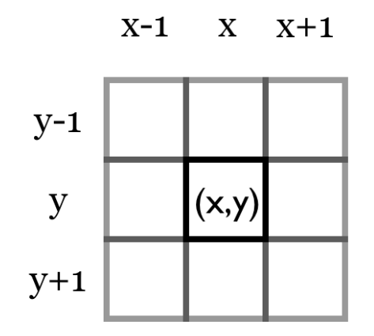

# Cellular Automata Cave Generator

# Overview

## Description

This simple console application is to explore procedural generation of 'cave like' levels using *Cellular Automata* to generate 'natural' looking cave systems.
This application is focused on the procedural generation of the maps so simply prints random maps to the console. However, the aim it to uitilise the `RandomCave`
Class at a later stage to make a procedurally generated console game. Below is an exaple of the output from this application:


## What is a Cellular Automata?

Cellular Automata are grid based systems that consist of an array of *bools*, each of the cells in the grid are bound by a set of very simple rules. These rules 
govern if each cell *Lives* or *Dies* in each cycle of the simulation. A good example of *Cellular Automata* in practice is **Conway's Game of Life**
([Conway's Game of Life Wikipedia Page](https://en.wikipedia.org/wiki/Conway%27s_Game_of_Life)).

In **Conway's Game of Life** each cell is governed by the below simple set of rules:

  * If a *living* cell had less than **2** *living* neighbours, it is *killed*.
  * If a *living* cell had **2 or 3** *living* neighbours, it stays *alive*.
  * If a *living* cell had more than **3** *living* neighbours, it is *killed*.
  * If a *dead* cell had exactly **3** *living* neighbours, it is *born*.

| **NOTE** | In the context of this page when a cell is *Alive* is is a `true` bool value. |
|---------|:-------------------------------------------------------------------------------|

The results produced by the simple rules that govern **Conway's Game of Life** can be surprisingly complex often leading to moving or repeating patterns for examples
please see the *Examples of Patterns* section of [Wikipedia Page](https://en.wikipedia.org/wiki/Conway%27s_Game_of_Life).

## How Does Cave Generator Work?

The *Cave Generator* works in a very similar manner to **Conway's Game of Life** where a *bool* array is created to represent a map, where all 'living' cell will be
printed to the console as a *Wall*. Again, in a similar manner to **Conway's Game of Life** the map is generated by applying a simple set or rules each *simulation 
step*. The process for cave generation is shown below;
  
  1. A 2D *bool* array is initialised to match the console window size. So each position in the array represents one position on the console application window.
  2. A probability is set for cells to be spawned *Alive*. This is represented by a percentage.
  3. The 2D array is itterated through randomly assigning each cell as *Dead* or *Alive* weighted by the probability set in **Step 2**.
  4. *Simulation Step* is run to apply the *rules* to each cell in the array. The rules applied to each cell are below:
    * If a *Dead* cell has a number of *Alive* neighbors > *birthLimit* then the cell is *Born*.
    * If an *ALive* cell has a number of *Alive* neighbors > *deathLimit* then the cell is *Killed*.
  5. The results of the *Simulation Step* are returned as a new 2d array.
  6. The *Simulation Step* will be run in a loop until the required map appearance is achieved. 
  7. Using the 2D Array the map is printed to the console window.

When counting the *Alive* neighbors cells within the *Moore Neighborhood* are considered. The *Moore Neighborhood* is the **8** cells immediately surrounding the
cell in question. The below image shows the *Moore Neighborhood*:



# `RandomCave` Class

## Description

The `RandomCave` Class is responsible for the procedural generation of the cave maps. It also has methods to print the maps to the console. It also has a number of
properties that can be used to tweek the procedurally generated output. 

## Properties

`ChanceToStartAlive` - Sets the probibility of cells initially spawning *Alive*. (Default **45%**)

`BirthLimit` - Sets the number of *Alive Neighbours* a *Dead* cell needs to be **Born**. (Default **4**)

`DeathLimit` - Sets the number of *Alive Neighbours* an *Alive* cell needs to be **Killed**. (Default **3**)

`SimulationSteps` - Sets how many times `simulationStep()` will be run. (Default **2**)

`WallColor` - Sets the cave wall color. (Default `ConsoleColor.Green`)

## Methods

### initializeMap()

This method is used to create the initial randomized 'cell map'. This cell map consists of randomly assigned 'alive' and 'dead' cells in a map the same 
size as the console window. The probability of a cell being initialized as 'alive' is governed by the `ChanceToSpawnAlive` property. 

```c#
 public bool[,] initializeMap()
        {
            // Assisgn a blank 2D bool array the size of the console window. [x,y]
            bool[,] startingMap = new bool[Console.WindowWidth,Console.WindowHeight];
            // Create a random number generator.
            Random randomNumber = new Random();

            // Loop through every cell in the array and used random number to see if the cell starts 'alive'.
            for (int x = 0; x < startingMap.GetLength(0); x++)
            {
                for (int y = 0; y < startingMap.GetLength(1); y++)
                {
                    // Cell starts alive if random number < ChanceToStartAlive
                    if (randomNumber.Next(0, 100) <= ChanceToStartAlive)
                    {
                        startingMap[x, y] = true;
                    }
                }
            }

            // Return initialized map
            return startingMap;
        }
```

### countAliveNeighbours()

This method takes in a map and a position and returns a count of alive neighbours. This check the *Moore  Neighbourhood*, the surrounding 
8 cells. 

```c#
private int countAliveNeighbours(bool[,] map, int xPosition, int yPosition)
        {
            int count = 0;

            // Loop through 8 surrounding neighbours. (Moore Neighborhood)
            for (int i = -1; i < 2; i++)
            {
                for (int j = -1; j < 2; j++)
                {
                    int neighbourXPosition = xPosition + i;
                    int neighbourYPosition = yPosition + j;

                    if(i == 0 && j == 0)
                    {
                        // Do nothing, this is the current cell.
                    }
                    else if(isOutOfMapArea(map, neighbourXPosition, neighbourYPosition))
                    {
                        // If a cell is out of bounds increment count. When left like this is helps to fill in map edges.
                        count++;
                    }
                    else if(map[neighbourXPosition, neighbourXPosition])
                    {
                        // If cell is alive increment count.
                        count++;
                    }
                }
            }

            return count;
        }
```
| **NOTE**  | If a cell is *Out of Map Bounds* the count will be incremented. This helps to fill in map edges. Results are quite different without this. |
|-----------|:-------------------------------------------------------------------------------------------------------------------------------------------|

### isOutOfMapArea()

This method take in a map and position and resturns a bool. If the position is within the map area it will return False` and if the point
is outside the map area it will return `True`

```c#
private bool isOutOfMapArea(bool[,] map, int xPosition, int yPosition)
        {
            bool isOutOfArea;

            //If the position is out of bounds return true.
            if (xPosition < 0 || yPosition < 0 || xPosition >= map.GetLength(0) || yPosition >= map.GetLength(1))
            {
                isOutOfArea = true;
            }

            //If the position is in bounds return flase.
            else
            {
                isOutOfArea = false;
            }

            return isOutOfArea;
        }
```

### PrintMap()

This method is used to print the mapto the console. First, the conaole is cleared using `Console.Clear()`. Once the console window has been
cleared the map 2D Array is looped through and each cell checked. If the cell is `True` a `█` character is printed, if `False` the cell is 
left blank.

```C#
public void PrintMap(bool[,] map)
        {
            Console.Clear();

            for (int x = 0; x < map.GetLength(0); x++)
            {
                for (int y = 0; y < map.GetLength(1); y++)
                {
                    if (map[x, y])
                    {
                        Console.SetCursorPosition(x, y);
                        Console.Write("█");
                    }
                }
            }
        }
```
